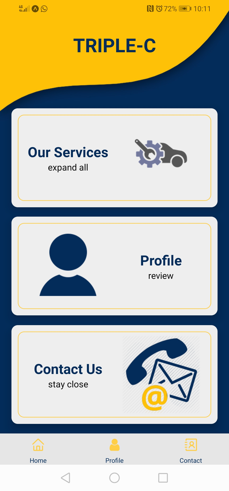
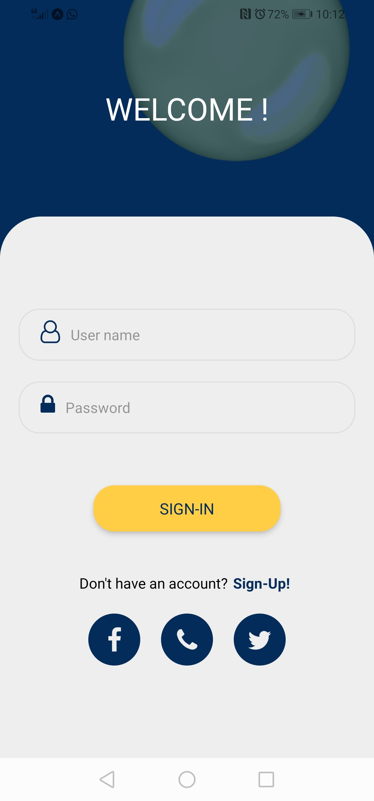
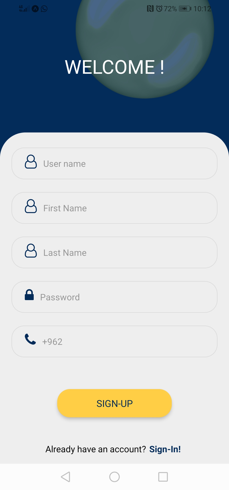
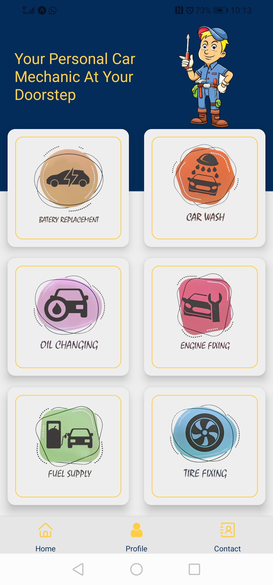
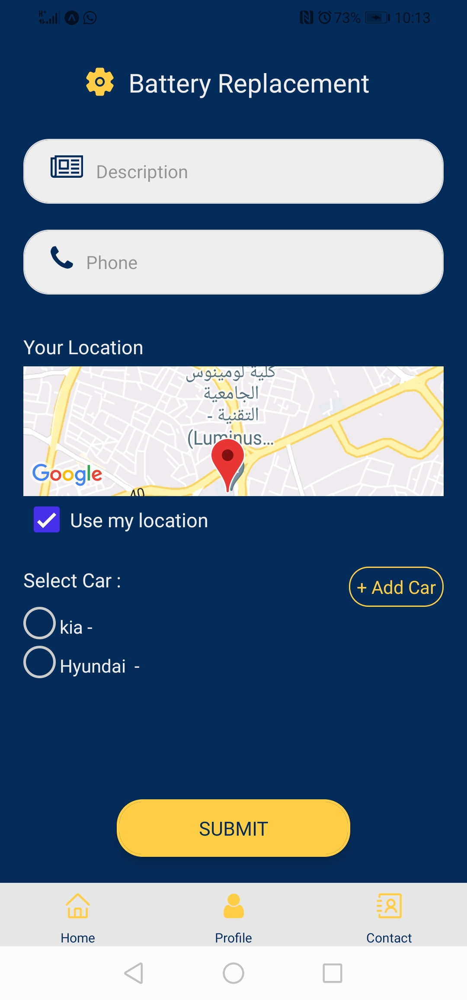
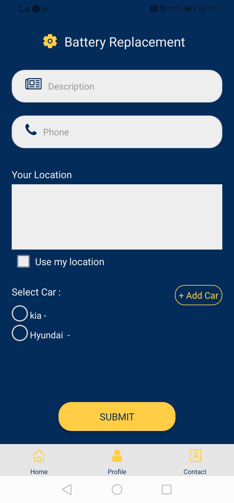
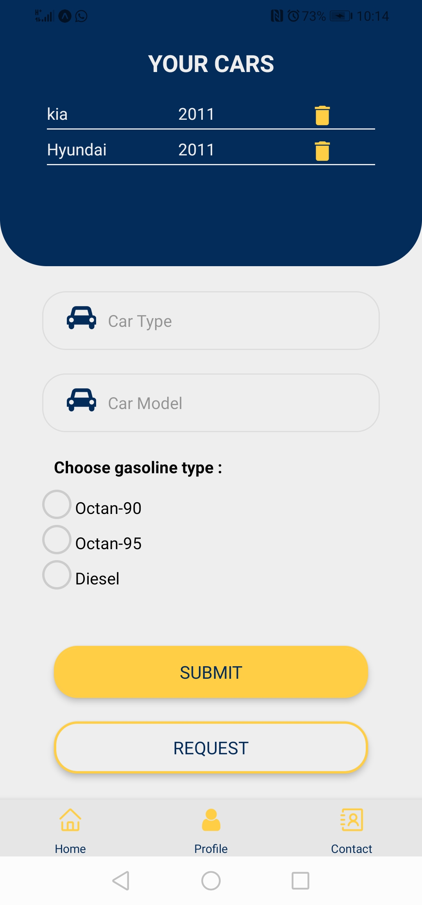
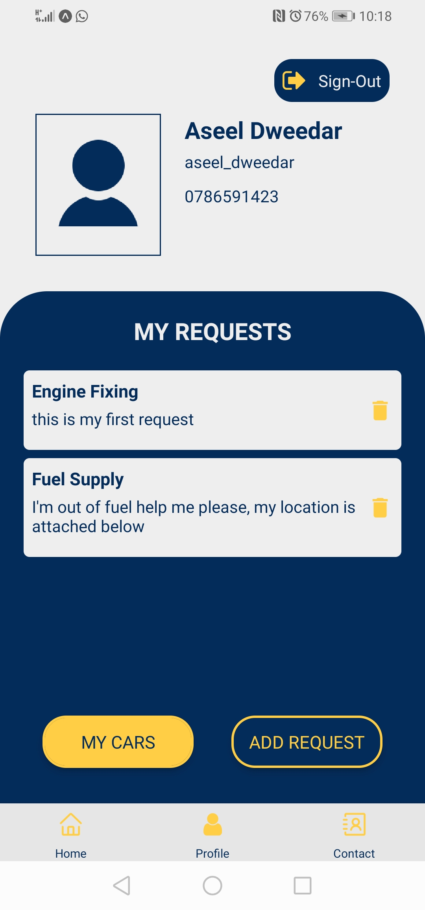
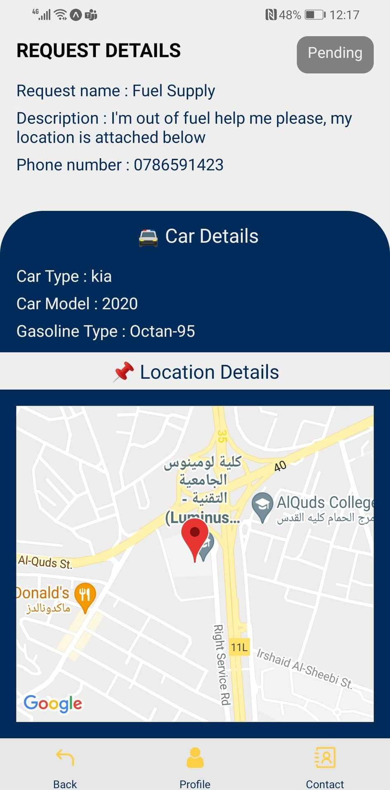
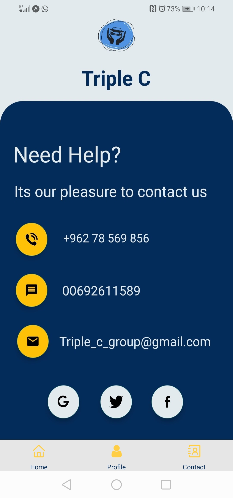

# TRIPLE-C

Most people don't have enough time to go to the station every time they want to wash their cars, or exposed all the time to get a puncture, runs out of fuel. And they don't have a good experience with cars.

Triple-C is A mobile application that introduces cars services in place. developed using React-native, Node.js (Express), MongoDB.

It is designed to be easy to use and with high accuracy. Taking into account the consistency of colors, and various designs. To make the user experience unique.

### **How to start** ..

- **Server side**

  Clone the repository --> npm install --> add to env variable all necessary link as added in the `.env.sample` file.

- **Clint side**

  move to clint --> yarn install --> add to env variable all necessary link as added in the `.env.sample` file.

## App content

**Home page**

 

**Sign-In - Sign-Up**

 

**Our Services**

 

**Add new request**

 

**Your car - Add new car**

 

**Your Profile**

 

**Deatails Page**

 

**Contact-Us**

